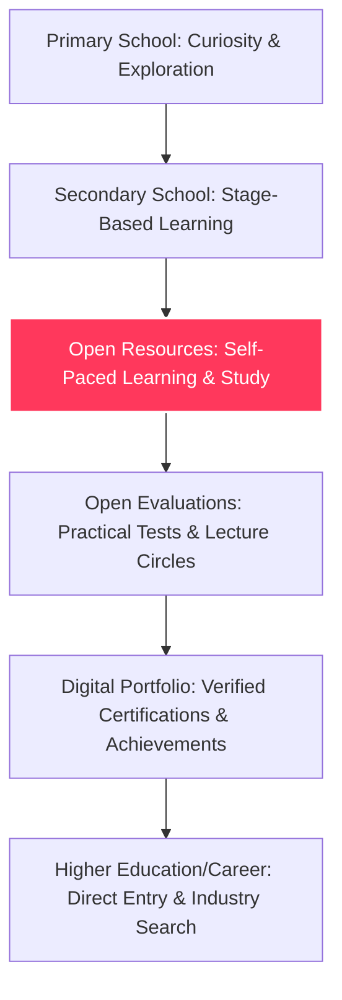

# Open Resources

The **Open Resources** platform is the first pillar of the **Open Education Model**—a decentralized, community-driven educational ecosystem. This repository implements a GitHub-like platform for free, accessible, and collaborative study materials.

Currently, this repository hosts the early version of the platform web application, designed to display, render, and manage educational documentation and notes.

---

## 📖 What is the Open Resources Pillar?

Under the Open Education Model, **Open Resources** acts as the foundation of learning:
* **Free & Accessible**: Knowledge is made available to everyone regardless of location, background, or wealth.
* **Community-Driven**: Anyone can contribute, curate, and refine learning materials (like notes, books, or courses).
* **Simple Digital Formats**: Resources are written in clean, digital text files (Markdown), making them lightweight, printable, easily translatable, and fully optimized for future AI tools.
* **Lecture Video Integration**: Video lectures (e.g., from YouTube) are embedded directly within documentation, preserving original creator views and ad-revenue (a win-win model).
* **Collaborative Improvements**: Users can clone resources, propose updates, or publish fork-versions to tailor materials to specific curricula or dialects.

---

## 🔄 Position in the Open Education Model

While this repository focuses on implementing the **Open Resources** platform, it serves as the entry point to the broader four-pillar ecosystem:



*This repository implements **Pillar 1 (Open Resources)**, which acts as the self-paced learning canvas utilized throughout the Secondary Schooling and Open Evaluation phases.*

---

## 💻 Tech Stack & Features

The Open Resources platform website is built using:
* **Framework**: React 19 + TypeScript + Vite
* **Routing**: React Router 8 (with dynamic routing for reading Markdown documents)
* **Styling**: Tailwind CSS v4 + `@tailwindcss/vite`
* **UI System**: Clean, minimal, photography-first design system inspired by Airbnb's aesthetics (see [DESIGN.md](file:///home/alex/Documents/Projects/Open%20Resources/docs/DESIGN.md))
* **Content Rendering**: Rich markdown engine using `marked` (with code syntax highlighting) and `mermaid` for inline diagram and flowchart generation.
* **Database & Auth**: Supabase integration ready (`@supabase/supabase-js`, `@supabase/ssr`)

---

## 📁 Repository Structure

* **[docs/](file:///home/alex/Documents/Projects/Open%20Resources/docs)**: System blueprints and design guides.
  * **[DESIGN.md](file:///home/alex/Documents/Projects/Open%20Resources/docs/DESIGN.md)**: Airbnb-style typography, spacing, colors, and components.
* **[website/](file:///home/alex/Documents/Projects/Open%20Resources/website)**: The source code for the platform web application.
  * **[website/public/open-education-docs/](file:///home/alex/Documents/Projects/Open%20Resources/website/public/open-education-docs)**: The markdown documentation files outlining the model's philosophy.
  * **[website/src/](file:///home/alex/Documents/Projects/Open%20Resources/website/src)**: React app sources (components, custom markdown renderer, routing logic, layouts).
* **[GEMINI.md](file:///home/alex/Documents/Projects/Open%20Resources/GEMINI.md)**: Guidelines for AI-assisted development.

---

## 🚀 Getting Started

To launch the website locally:

1. Navigate to the website folder:
   ```bash
   cd website
   ```
2. Install project dependencies:
   ```bash
   pnpm install
   ```
3. Start the dev server:
   ```bash
   pnpm dev
   ```

Open `http://localhost:5173` to browse the documents and verify the rendering.

---

## 🤝 Contributing

This platform is licensed under the **AGPL-3.0** license. Feel free to contribute by:
1. Writing or refining study notes inside `/website/public/open-education-docs/` or contributing new resource packages.
2. Improving the web application interface, markdown engine, or adding database features.

*Let's stop conforming to the cage, and start building the door.*
