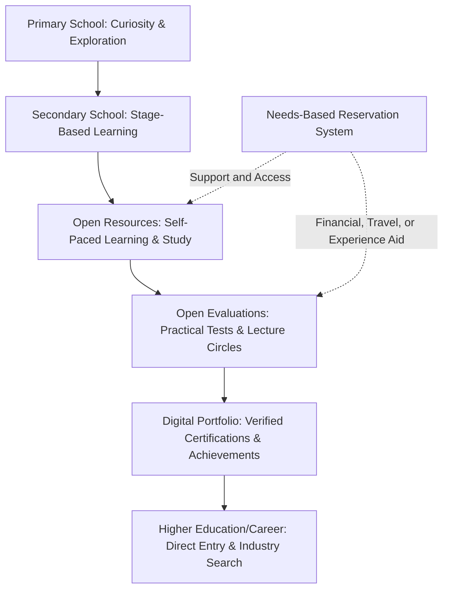

# How Does This Model Work

To truly understand the Open Education Model, we must look beyond its individual pillars and see how they connect to form a cohesive, self-regulating, and learner-centric ecosystem. 

Unlike the traditional system—which operates as a rigid, one-size-fits-all conveyor belt—this model operates as a network of opportunities. Here is how the pillars work in tandem to guide a student's journey:

1.  **Exploration & Discovery:** The journey starts in **Primary Schooling**, where children are not forced to memorize subjects. Instead, they play, create, watch educational films, and discover their natural inclinations.
2.  **Self-Paced Progression:** In **Secondary Schooling**, students study at their own pace using **Open Resources**—a free, community-driven repository of text, video lectures, and AI-enabled study guides available in multiple languages.
3.  **Level Playing Field:** If a student faces financial or geographical barriers, the **New Reservation System** steps in. A reservation agent conducts an in-person audit and grants targeted aid (financial, travel, or experience-based support), ensuring they are never left behind.
4.  **Demonstrating Competence:** When ready, the student books an **Open Evaluation** (practical lab work, hackathons, or a collaborative "Lecture Circle"). Successful evaluation awards a certificate whose value is backed by the reputation of the issuing agency.
5.  **Building a Portfolio:** The certified skills and real-world creations are logged onto the student's **Digital Portfolio**. Employers can search this directory directly, bypassing traditional degree filters and finding candidate matches based on verified practical achievements.

---

## Case Studies: Real-World Student Journeys

To see how this ecosystem reshapes education, let us follow five hypothetical students with very different backgrounds, goals, and learning styles.

### 1. Aarav: The Hands-On Tech Prodigy
*Aarav has always been obsessed with electronics and coding. In the traditional system, he is considered a "mediocre" student because he refuses to write lengthy history essays or memorize chemistry tables, preferring to spend his nights building Arduino devices.*

*   **Learning via Open Resources:** Aarav doesn't sit through lectures on subjects he has already mastered or has no interest in. He uses the platform to access advanced programming modules and physics documents, learning at a speed that matches his intellect.
*   **Flexible Schooling Stages:** Aarav's secondary school doesn't restrict him by grade. He progresses to **Mathematics Stage 10** and **Physics Stage 9**, while staying at **Literature Stage 4** and **History Stage 3**. He isn't held back in science just because he hasn't passed his humanities requirements.
*   **Verification through Creation:** Aarav builds a custom drone that automates soil moisture detection. He registers for a regional hardware hackathon hosted by a respected Open Evaluation agency. 
*   **The Outcome:** He passes the evaluation and receives a certified endorsement from the agency. His report card highlights this real-world achievement at the very top. Instead of an empty GPA, his digital portfolio contains verified links to his code repositories and a video demonstrating his drone. When a local tech startup searches the platform's worker engine for hardware skills, Aarav’s profile matches immediately.

---

### 2. Priya: The Aspiring Athlete
*Priya is a gifted runner training for national athletics. In the traditional system, her dream is constantly threatened. The requirement of 75% daily attendance and yearly exam seasons force her to choose between athletic training and passing her classes.*

*   **Freedom from the Classroom:** Under the new schooling system, daily school attendance is optional in secondary grades. Priya trains on the track for six hours a day.
*   **Portable Learning:** When traveling for tournaments, she downloads printable PDFs and open-source audio lessons. She studies in transit and during rest cycles, free from classroom walls.
*   **On-Demand Evaluations:** Priya doesn't have to face rigid exam seasons that conflict with her athletic calendar. When her training season ends, she books subject stage evaluations at her school at her own convenience.
*   **The Outcome:** Priya’s report card proudly lists her state athletic medals alongside her current subject stages (e.g., *Biology Stage 8, Mathematics Stage 5*). She is celebrated by her school and community, and she moves toward higher sports academies without the psychological burden of being labeled an academic failure.

---

### 3. Kabir: The Rural Learner with Hardships
*Kabir lives in a remote village. His parents work as daily wage laborers and cannot afford textbooks, laptops, or tuition fees. There are no advanced schools or coaching centers near him.*

*   **Physical Verification & Targeted Support:** A dedicated reservation agent visits Kabir’s home. Observing the family’s economic constraints, the agent issues a needs-based reservation consisting of **Financial Aid** and **Travel & Accommodation Aid**.
*   **Accessible Resources:** Kabir accesses Open Resources in his native language on a cheap smartphone or through physical textbooks printed for him at no cost (funded by the platform's commercial print-revenue share).
*   **Free Practical Access:** When Kabir wants to learn practical chemistry, his financial aid reservation covers the lab fees. His travel aid reservation pays for his bus fare and stay at a district hub where he attends a week-long practical workshop.
*   **The Outcome:** Kabir takes his evaluations alongside urban students, fully supported by the community-funded reservation system. The agent who verified him is held strictly accountable; if the reservation is ever audited and found to be misused, the agent faces suspension. This keeps the system free from corruption, ensuring that Kabir gets the support he deserves to compete on a level playing field.

---

### 4. Siddharth: The 35-Year-Old Career Pivot
*Siddharth has spent fifteen years working as a billing clerk. He wants to transition into data analytics, but traditional universities require full-time enrollment, high tuition fees, and prerequisite degrees he doesn't have. He is also concerned about age barriers.*

*   **No Age Barriers:** The Open Education Model has zero age restrictions. Siddharth has the same right to learn and be evaluated as any teenager.
*   **Night-Schooling with Open Resources:** Siddharth retains his day job to support his family. At night, he studies databases, statistics, and machine learning using community-curated courses on the platform.
*   **Credible Certifications:** Siddharth joins an online **Lecture Circle** hosted by an industry-respected data science evaluation agency. He presents a data dashboard he built, defends his calculations against critiques from peers, and answers questions from evaluators.
*   **The Outcome:** Siddharth passes the evaluation and earns a certificate. Because the agency's credentials are highly respected in the tech sector, employers trust the certificate. His age and past background become irrelevant; his verified digital portfolio showcases his actual capacity, allowing him to successfully transition to a data analyst role.

---

### 5. Meera: The Concept-Rich Student with Exam Anxiety
*Meera is an exceptionally bright student who understands biological concepts deeply. However, she suffers from severe performance anxiety. During high-pressure standardized exam seasons (like typical board exams or NEET), her mind blanks out, leading to poor test scores that fail to reflect her true capability.*

*   **Distributing the Pressure:** Meera doesn't have to face a single, high-stakes "exam day" that determines her entire future. She takes her subject stage evaluations one by one, only when she feels completely prepared.
*   **Alternative Assessment (The Lecture Circle):** Instead of a rigid written test, Meera signs up for a Lecture Circle evaluation in Biology. In this setting, she delivers a presentation explaining the human circulatory system, answers follow-up doubts from other students, and questions them in return.
*   **The Outcome:** Evaluators assess her command over the subject through active discussion, peer interactions, and conceptual explanation rather than rote recall under a timer. She earns a high-tier certificate, proving her expertise in a collaborative, supportive environment that minimizes anxiety and values actual understanding over test-taking speed.

---

## A Self-Regulating Cycle of Trust

The ultimate power of this model lies in its ability to self-regulate without central control or government force:

*   **Employers** trust the certificates because corrupt agencies that sell credentials naturally lose their reputation and fade away.
*   **Creators** keep the syllabus updated because outdated resources are rated down by the community and ignored by students.
*   **Schools** focus on student support and life-skills because their success is measured by the real-world achievements of their students, not standardized test scores.
*   **Reservations** reach the right hands because agents are held personally accountable for their verifications, and citizens are empowered to report fraud through an audited reporting system.

By shifting the focus from **gatekeeping** to **enabling**, the Open Education Model transforms education from a stressful competition into a lifelong journey of personal and practical growth.
