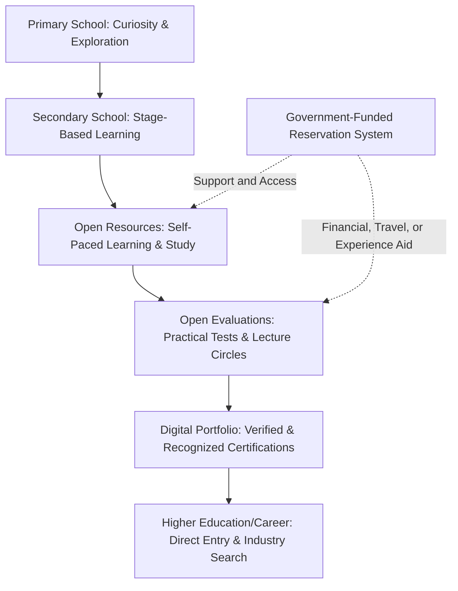

# How Does This Model Work

To truly understand the Open Education Model, we must look beyond its individual pillars and see how they connect to form a cohesive, self-regulating, and learner-centric ecosystem. 

Unlike the traditional system—which operates as a rigid, one-size-fits-all conveyor belt—this model operates as a hybrid network of opportunities. Here is how the community-run learning pillars and government-funded/recognized pillars work in tandem to guide a student's journey:

> *Note on the Hybrid Structure: Learning materials (Open Resources), evaluations, and school teaching remain 100% community-run and free of government control. Government's role is strictly bounded to funding & operating the Reservation System and granting legal recognition to Open Evaluation certificates.*

1.  **Exploration & Discovery:** The journey starts in **Primary Schooling**, where children are not forced to memorize subjects. Instead, they play, create, watch educational films, and discover their natural inclinations.
2.  **Self-Paced Progression:** In **Secondary Schooling**, students study at their own pace using **Open Resources**—a free, community-driven repository of text, video lectures, and AI-enabled study guides available in multiple languages.
3.  **Level Playing Field:** If a student faces financial or geographical barriers, the government-funded **New Reservation System** steps in. A physical verification agent conducts an in-person audit using public welfare infrastructure and grants targeted aid (financial, travel, or experience-based support), ensuring they are never left behind.
4.  **Demonstrating Competence:** When ready, the student books an **Open Evaluation** (practical lab work, hackathons, or a collaborative "Lecture Circle"). Successful evaluation awards a certificate whose value is backed by the reputation of the issuing agency and holds official legal recognition from the government for jobs, licensure, and higher education.
5.  **Building a Portfolio:** The certified skills and real-world creations are logged onto the student's **Digital Portfolio**. Employers and universities can search this directory directly, bypassing traditional degree filters and finding candidate matches based on legally recognized, verified practical achievements.

---

## Case Studies: Real-World Student Journeys

To see how this ecosystem reshapes education, let us follow five hypothetical students with very different backgrounds, goals, and learning styles.

### 1. Aarav: The Hands-On Tech Prodigy
*Aarav has always been obsessed with electronics and coding. In the traditional system, he is considered a "mediocre" student because he refuses to write lengthy history essays or memorize chemistry tables, preferring to spend his nights building Arduino devices.*

*   **Learning via Open Resources:** Aarav doesn't sit through lectures on subjects he has already mastered or has no interest in. He uses the platform to access advanced programming modules and physics documents, learning at a speed that matches his intellect.
*   **Flexible Schooling Stages:** Aarav's secondary school doesn't restrict him by grade. He progresses to **Mathematics Stage 10** and **Physics Stage 9**, while staying at **Literature Stage 4** and **History Stage 3**. He isn't held back in science just because he hasn't passed his humanities requirements.
*   **Verification through Creation:** Aarav builds a custom drone that automates soil moisture detection. He registers for a regional hardware hackathon hosted by a respected Open Evaluation agency. 
*   **The Outcome:** He passes the evaluation and receives a certified endorsement from the agency. Because the agency holds government recognition based on auditable standards, his credential carries formal legal weight alongside high industry reputation. His report card highlights this real-world achievement at the top. When a local tech startup or government agency searches the platform for hardware skills, Aarav’s profile matches immediately.

---

### 2. Priya: The Aspiring Athlete
*Priya is a gifted runner training for national athletics. In the traditional system, her dream is constantly threatened. The requirement of 75% daily attendance and yearly exam seasons force her to choose between athletic training and passing her classes.*

*   **Freedom from the Classroom:** Under the new schooling system, daily school attendance is optional in secondary grades. Priya trains on the track for six hours a day.
*   **Portable Learning:** When traveling for tournaments, she downloads printable PDFs and open-source audio lessons. She studies in transit and during rest cycles, free from classroom walls.
*   **On-Demand Evaluations:** Priya doesn't have to face rigid exam seasons that conflict with her athletic calendar. When her training season ends, she books subject stage evaluations at her school at her own convenience.
*   **The Outcome:** Priya’s report card proudly lists her state athletic medals alongside her current subject stages (e.g., *Biology Stage 8, Mathematics Stage 5*). She is celebrated by her school and community, and she moves toward higher sports academies without the psychological burden of being labeled an academic failure.

---

### 3. Kabir: The Rural Learner with Hardships
*Kabir lives in a remote village. His parents work as daily wage laborers and cannot afford textbooks, laptops, or tuition fees. There are no advanced schools or coaching centers near him.*

*   **Government-Funded Physical Verification:** A government-funded physical verification agent visits Kabir’s home. Observing the family’s economic constraints, the agent issues a needs-based reservation consisting of **Financial Aid** and **Travel & Accommodation Aid**, backed by sustainable public funding.
*   **Accessible Resources:** Kabir accesses Open Resources in his native language on a cheap smartphone or through physical textbooks printed for him at no cost (funded by the platform's commercial print-revenue share).
*   **Free Practical Access:** When Kabir wants to learn practical chemistry, his financial aid reservation covers the lab fees. His travel aid reservation pays for his bus fare and stay at a district hub where he attends a week-long practical workshop.
*   **The Outcome:** Kabir takes his evaluations alongside urban students, fully supported by the government-funded reservation system. The agent who verified him is held strictly accountable under civil service penalty rules and community reporting. This keeps the system free from corruption, ensuring that Kabir gets sustainable support to compete on a level playing field.

---

### 4. Siddharth: The 35-Year-Old Career Pivot
*Siddharth has spent fifteen years working as a billing clerk. He wants to transition into data analytics, but traditional universities require full-time enrollment, high tuition fees, and prerequisite degrees he doesn't have. He is also concerned about age barriers.*

*   **No Age Barriers:** The Open Education Model has zero age restrictions. Siddharth has the same right to learn and be evaluated as any teenager.
*   **Night-Schooling with Open Resources:** Siddharth retains his day job to support his family. At night, he studies databases, statistics, and machine learning using community-curated courses on the platform.
*   **Legally Recognized Certifications:** Siddharth joins an online **Lecture Circle** hosted by a recognized data science evaluation agency. He presents a data dashboard he built, defends his calculations against critiques from peers, and answers questions from evaluators.
*   **The Outcome:** Siddharth passes the evaluation and earns a certificate. Because government grants official recognition to certificates from vetted agencies, his qualification carries formal legal and professional weight for job requisitions. His age and lack of a traditional degree become irrelevant; his verified digital portfolio showcases his actual capacity.

---

### 5. Meera: The Concept-Rich Student with Exam Anxiety
*Meera is an exceptionally bright student who understands biological concepts deeply. However, she suffers from severe performance anxiety. During high-pressure standardized exam seasons (like typical board exams or NEET), her mind blanks out, leading to poor test scores that fail to reflect her true capability.*

*   **Distributing the Pressure:** Meera doesn't have to face a single, high-stakes "exam day" that determines her entire future. She takes her subject stage evaluations one by one, only when she feels completely prepared.
*   **Alternative Assessment (The Lecture Circle):** Instead of a rigid written test, Meera signs up for a Lecture Circle evaluation in Biology. In this setting, she delivers a presentation explaining the human circulatory system, answers follow-up doubts from other students, and questions them in return.
*   **The Outcome:** Evaluators assess her command over the subject through active discussion, peer interactions, and conceptual explanation rather than rote recall under a timer. She earns a high-tier, government-recognized certificate, proving her expertise in a collaborative, supportive environment that minimizes anxiety and values actual understanding over test-taking speed.

---

### 6. Rohan: The Late Bloomer / Lost Learner
*Rohan has no obvious passions or academic talents. Unlike Aarav or Priya, he is completely lost, struggles with basic concepts, and has no idea what career path to pursue. In the traditional system, he would have been held back repeatedly, labeled a failure, and eventually dropped out with destroyed self-esteem. Under the Open Education Model, Rohan remains in the secondary schooling phase until he is 20, performing poorly on standard metrics.*

*   **A Low-Pressure Sanctuary:** Because the school system does not force students through rigid age-based classes or threaten them with expulsion for slow progress, Rohan is allowed to stay in school without shame. The school's focus shifts from forcing academic compliance to supporting his personal well-being, character development, and life skills (such as finance, confidence, and communication).
*   **System-Guided Exploration:** Rather than leaving him to drift, the school's **active guidance** framework includes **exploratory rotations** and **practical life-skills projects** specifically designed for undecided students. Mentors guide Rohan through various hands-on roles, from managing library inventory to helping coordinate local community-service operations.
*   **The Spark of Discovery:** At age 16, during a guided school-run project where he is assigned to coordinate the hosting logistics for an external Open Evaluation event, Rohan discovers a natural talent for logistical planning, coordination, and community kitchen management. Using the platform's Open Resources, he takes introductory courses on hospitality management and culinary arts.
*   **The Outcome:** Rohan works closely with school mentors to build a basic practical portfolio. He passes a localized Open Evaluation in event coordination and hospitality, earning a government-recognized credential. He transitions into a junior coordinator role at a local community center. The system's patience and lack of rigid age limits allowed him to grow and find his place in society on his own timeline, rather than being discarded by the wayside.

---

## A Self-Regulating Cycle of Trust

The ultimate power of this model lies in how community self-regulation and bounded government support reinforce one another:

*   **Employers & Universities** trust the certificates because government grants legal validity while corrupt agencies that sell credentials naturally lose community reputation and fade away.
*   **Government** provides funding for reservations and legal standing for certificates without spending public funds on bureaucratic curriculum management.
*   **Creators** keep the syllabus updated because outdated resources are rated down by the community and ignored by students.
*   **Schools** focus on student support and life-skills because their success is measured by the real-world achievements of their students, not standardized test scores.
*   **Reservations** reach the right hands because agents operate under official civil accountability and citizens are empowered to report fraud through an audited reporting system.

By shifting the focus from **monopolistic gatekeeping** to **community enabling with official legal backing**, the Open Education Model transforms education from a stressful competition into a lifelong journey of personal and practical growth.
